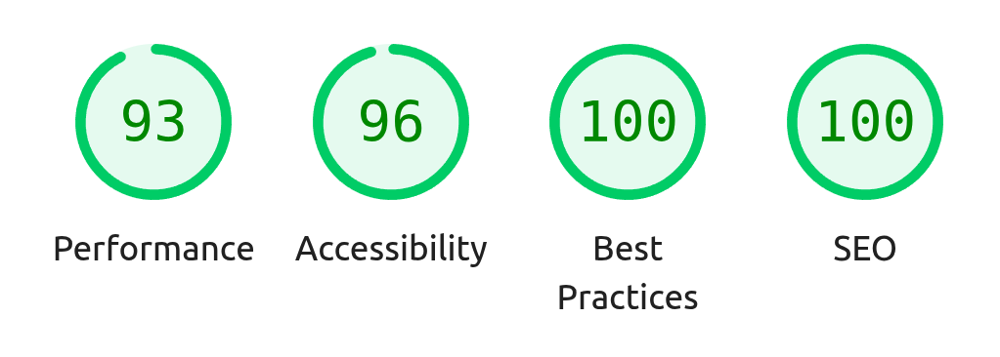

# nimbiCMS

Lightweight, lightspeed, SEO-first client-side Content Management System

## The project

nimbiCMS is a client-side CMS for static sites that requires **no database, no server build step, and no backend**, just a bunch of Markdown or HTML pages and a minimalistic setup

Just drop your Markdown files into a folder, serve the site (GitHub Pages, S3, etc.), and the client will crawl the content, render Markdown to HTML, hook links, manage slugs and anchors, maintain navigation and search functionalities, and update SEO tags on the fly. All that while being compliant, fast and accesible!



Editing content via the GitHub web editor works too—just save and refresh to see updates.

The code lives at [https://github.com/AbelVM/nimbiCMS](https://github.com/AbelVM/nimbiCMS)

## Features

- Client-side rendering of [GitHub‑flavored Markdown](https://github.github.com/gfm/) via [marked.js](https://marked.js.org/), no need for site compilation
- No Jekyll, no Hugo, no CI at all
- Perfect for static servers (GitHub Pages, S3, etc.)
- Optional client-side search box built from headings and excerpts (enabled by default).
- Reading time estimation
- Code is organized into small modules to ease maintenance and testing.
- Sticky per-page, dynamically generated TOC.
- [Bulma](https://bulma.io/)‑based UI components.
- Runtime updates for SEO, Open Graph and Twitter meta tags.
- Markdown headers management ([yaml_metadata_block by pandoc](https://pandoc.org/MANUAL.html#extension-yaml_metadata_block))
- Lazily loads images by default, while heuristically marking above‑the‑fold images as eager.
- Image preview modal with zoom controls, wheel zoom, drag pan, double-click to zoom, and touch pinch support.
- Syntax highlighting using [highlight.js](https://highlightjs.org/) — languages are auto-registered when detected.
- Simple theming (light/dark), Bulma and hightlight.js customization options.
- Simplified deliverables: regardless all the dynamic imports, the bundle is kept in one JS file and one CSS file
- Bundle is compact size
  - JS file: 243.74 kB, gzipped 70.62 kB (for UMD bundle)
  - CSS file: 504.87 kB, gzipped 47.85 kB (includes Bulma)
- All the heavy work is managed by web workers to avoid hogging the main thread
- Pluggable architecture through the available hooks
- Fully typed and [documented](docs/README.md)
- [MIT licensed](LICENSE.md)

## Installation

### From npm

```bash
npm install nimbi-cms
npm run build
```

### From CDN

You can use jsDelivr or unpkg to load the bundles directly in the browser without installing.

```html
<!-- jsDelivr ESM -->
<link rel="stylesheet" href="https://cdn.jsdelivr.net/npm/nimbi-cms@1.0.0/dist/nimbi-cms.css">
<script type="module">
  import initCMS from 'https://cdn.jsdelivr.net/npm/nimbi-cms@1.0.0/dist/nimbi-cms.es.js'
  initCMS({ el: '#app' })
</script>

<!-- UMD (unpkg) -->
<script src="https://unpkg.com/nimbi-cms@1.0.0/dist/nimbi-cms.js"></script>
<link rel="stylesheet" href="https://unpkg.com/nimbi-cms@1.0.0/dist/nimbi-cms.css">
<script>
  // UMD exposes a global `nimbiCMS`
  nimbiCMS.initCMS({ el: '#app' })
</script>
```

For development with live reload:

```bash
npm run dev
```

## How to use

### Basic HTML example

```html
<!doctype html>
<html><head><meta charset="utf-8">
<script src="/dist/nimbi-cms.js"></script>
<link rel="preload" href="/dist/nimbi-cms.css" as="style" onload="this.rel='stylesheet'">
<noscript><link rel="stylesheet" href="/dist/nimbi-cms.css"></noscript>
</head><body>
<div id="app" style="height:100vh"></div>
<script>
  nimbiCMS.initCMS({ el: '#app' })
</script>
</body></html>
```

### Bundle formats

Examples showing how to consume each shipped bundle format produced by the build.

- UMD (browser global)

```html
<!-- include the UMD bundle and CSS -->
<link rel="stylesheet" href="/dist/nimbi-cms.css">
<script src="/dist/nimbi-cms.js"></script>
<div id="app"></div>
<script>
  // UMD exposes a global `nimbiCMS` object
  nimbiCMS.initCMS({ el: '#app' })
</script>
```

- ESM (modern bundlers / `<script type="module">`)

```html
<script type="module">
  import initCMS from '/dist/nimbi-cms.es.js'
  initCMS({ el: '#app' })
</script>
```

- CJS (Node / CommonJS consumers)

```js
const { initCMS } = require('./dist/nimbi-cms.cjs.js')
initCMS({ el: '#app' })
```

**Notes:**

- The UMD build is a single, self-contained `dist/nimbi-cms.js` file that exposes the public API on the `nimbiCMS` global.
- The ES build is `dist/nimbi-cms.es.js` and is ideal for modern bundlers and `<script type="module">` usage.
- The CJS build is `dist/nimbi-cms.cjs.js` for CommonJS consumers.
- CSS is always shipped as `dist/nimbi-cms.css` and should be loaded alongside the script for styling. For performance optimization, it's advised to preload the CSS file like:

```html
<link rel="preload" href="/dist/nimbi-cms.css" as="style" onload="this.rel='stylesheet'">
<noscript><link rel="stylesheet" href="/dist/nimbi-cms.css"></noscript>
```

### Content Workflow

Drop `.md` and/or `.html` files into your content directory. No build step is necessary; a static server that serves the files is sufficient.

> When loading `.html` files, only the `body` block is parsed. All the code in `head` is overriden, so, if you want some specific styling or script being run for that page, add them to `body`. Check `assets/playground.html` source for an example

**Required files**

- `_home.md` — required by default. You can override this with the `homePage` option to use a different `.md` or `.html` file as the home page.

```javascript
initCMS({ el: '#app', homePage: 'index.html' })
```

- `_navigation.md` — renders into the navbar; use Markdown links. Example nav markup:

```markdown
[Home](_home.md)
[Blog](blog.md)
[About](about.md)
```

- `_404.md` — optional fallback for 404 responses. When the server responds to a requested `.md` path with an HTML document (e.g., an SPA fallback serving `index.html`), the CMS treats that as a missing markdown page and will attempt to load `/_404.md` from the configured content base so a proper 404 page can be rendered instead of the site's index HTML.

```javascript
initCMS({ el: '#app', notFoundPage: '_404.md' })
```

Links are converted to hash‑based navigation (`?page=…`), preserving anchors and URL passed parameters

## Options

`initCMS(InitOptions)` mounts the CMS into a page. The table below summarizes the supported `InitOptions`. This options can be overrrided using URL parameters with the same name.

### Core

| Option | Type | Default | Description |
|---|---:|:---:|---|
| `el` | `string` \ `Element` | required | CSS selector or DOM element used as the mount target. |
| `contentPath` | `string` | `/content` | URL path to the content folder serving `.md`/`.html` files; normalized to a relative path with trailing slash. |
| `allowUrlPathOverrides` | `boolean` | `false` | Opt-in: when `true`, `contentPath`, `homePage`, `notFoundPage`, and `navigationPage` may be overridden using URL params. |

### Indexing and Search

| Option | Type | Default | Description |
|---|---:|:---:|---|
| `searchIndex` | `boolean` | `true` | Enable the runtime search index and render a search box. |
| `searchIndexMode` | `'eager'` \| `'lazy'` | `'eager'` | When to build the index (`'eager'` on init, `'lazy'` on first query). |
| `indexDepth` | `1 \| 2 \| 3` | `1` | How deep headings are indexed (H1, H2, H3). |
| `noIndexing` | `string[]` | — | Paths (relative) to exclude from discovery and indexing. |
| `skipRootReadme` | `boolean` | `false` | When `true`, skip link discovery inside a repository-root `README.md`. |

### Routing and Pages

| Option | Type | Default | Description |
|---|---:|:---:|---|
| `homePage` | `string` | `'_home.md'` | Path for the site home page (`.md` or `.html`). |
| `notFoundPage` | `string` | `'_404.md'` | Path for the not-found page (`.md` or `.html`). |
| `navigationPage` | `string` | `'_navigation.md'` | Path for the navigation markdown used to build the navbar (`.md` or `.html`). |

> Note: All these files must be within `contentPath`

### Styling and Theming

| Option | Type | Default | Description |
|---|---:|:---:|---|
| `defaultStyle` | `'light'` \| `'dark'` \| `'system'` | `'light'` | Initial UI theme. |
| `bulmaCustomize` | `string` | `'none'` | `'none'` (bundled), `'local'` (load `<contentPath>/bulma.css`) or a Bulmaswatch theme name to load remotely. |
| `navbarLogo` | `string` | `'favicon'` | Small site logo placed at the leftmost position of the navbar. Supported values: `none`, `favicon` (uses PNG favicon when available), a path or URL to an image, `copy-first` (use first image from `homePage`), and `move-first` (use first image from `homePage` and remove it from the rendered page). |

### Localization

| Option | Type | Default | Description |
|---|---:|:---:|---|
| `lang` | `string` | — | UI language code (e.g. `en`, `de`). |
| `l10nFile` | `string \| null` | `null` | Path to a JSON localization file (relative paths resolve against the page). |
| `availableLanguages` | `string[]` | — | When set, treats a leading path segment as a language code and maps slugs per-language. |

### Caching and Performance

| Option | Type | Default | Description |
|---|---:|:---:|---|
| `cacheTtlMinutes` | `number` | `5` | TTL for slug-resolution cache entries (minutes). Set `0` to disable expiration. |
| `cacheMaxEntries` | `number` | — | Maximum entries in the router resolution cache. |
| `crawlMaxQueue` | `number` | `1000` | Upper bound on directories queued during breadth-first crawl (0 disables the guard). |

### Advanced and Extensions

| Option | Type | Default | Description |
|---|---:|:---:|---|
| `markdownExtensions` | `Array<object>` | — | `marked`-style extension/plugin objects registered at init via `addMarkdownExtension()`. |
| `markdownPaths` | `string[]` | — | Optional host-provided list of markdown paths used by slug resolution/search. |

## API

The `nimbi-cms` package exports a small set of helpers in addition to the default `initCMS` export. These are available as named imports in ESM and as properties on the `nimbiCMS` global in UMD builds.

For a complete listing of exported symbols and TypeScript types, see [the documentation](docs/README.md).

> **Note:** the default export (`initCMS`) and the `default` alias are intentionally excluded from the list below.

### Version

- `getVersion()` — returns a `Promise<string>` that resolves to the shipped package version (e.g. `"0.1.0"`). Useful for displaying build metadata or detecting whether the loaded bundle matches a deployed backend.

```js
import { getVersion } from 'nimbi-cms'
getVersion().then(v => console.log('nimbiCMS version', v))
```

### Hooks (extension points)

These helpers let you hook into internal rendering and navigation without forking the source.

- `addHook(name, fn)` — register a callback for one of the supported hook points (`'onPageLoad' | 'onNavBuild' | 'transformHtml'`).
- `onPageLoad(fn)` — fired after a page is rendered and inserted into the DOM. Useful for analytics, adding UI enhancements, or triggering client-side behavior once content is available.
- `onNavBuild(fn)` — fired after the navigation HTML is constructed but before it is attached to the document; ideal for mutating nav links, injecting controls, or adding a search input.
- `transformHtml(fn)` — fired just before an article node is appended; gives you access to the generated DOM element and HTML string so you can alter structure, add attributes, or instrument the output.
- `runHooks(name, ctx)` — programmatically invoke hook callbacks (useful in tests or when you want to replay a lifecycle event after manually inserting content).
- `_clearHooks()` — clear all registered hooks. This is mainly intended for unit tests so each test can start with a clean hook slate.

```js
import { onPageLoad, onNavBuild, transformHtml } from 'nimbi-cms'

onPageLoad(({ pagePath, article }) => {
  console.log('page rendered', pagePath)
  // e.g. initialize custom widgets inside the loaded article
})

onNavBuild(({ navWrap }) => {
  const btn = document.createElement('button')
  btn.textContent = 'Toggle theme'
  btn.onclick = () => setStyle('dark')
  navWrap.querySelector('.navbar-end')?.appendChild(btn)
})

transformHtml((html, article) => {
  // Add a data attribute to every rendered page
  article.dataset.nimbiRendered = 'true'
})
```

### Theming & Styling helpers

- `ensureBulma(bulmaCustomize?, pageDir?)` — ensures Bulma is loaded. Pass `'local'` to load a local `bulma.css` (looks in the page directory and `/${pageDir}/bulma.css`), or pass a Bulmaswatch theme name (e.g. `'flatly'`) to load from unpkg.
- `setStyle(style)` — switch between light/dark/system modes by updating `data-theme` and the `is-dark` class on the document. This matches the behavior of the built-in theme toggle.
- `setThemeVars(vars)` — apply a set of CSS custom properties (e.g. `{ "--primary": "#06c" }`) on the document root for runtime theming without rebuilding.

```js
import { ensureBulma, setStyle, setThemeVars } from 'nimbi-cms'

// Load a Bulmaswatch theme from unpkg
ensureBulma('flatly')

// Or load a local bulma.css (useful for self-hosted overrides)
ensureBulma('local', './content/')

setStyle('dark')
setThemeVars({ primary: '#06c', 'font-family': 'system-ui' })
```

### Localization helpers

- `t(key, ...args)` — translate a UI string key using the currently loaded locale dictionary. Supports parameter substitution like `t('helloUser', 'Alice')`.
- `loadL10nFile(url)` — fetch and merge a JSON localization file into the current dictionary. Does not automatically rerender UI (useful for on-demand language packs).
- `setLang(code)` — switch the UI language at runtime (e.g. `'en'`, `'de'`). This updates internal strings and affects slug resolution when `availableLanguages` is configured.

```js
import { t, loadL10nFile, setLang } from 'nimbi-cms'

// Dynamic translation
console.log(t('navigation'))

// Load an external translations file
await loadL10nFile('/i18n/l10n.json')
setLang('de')
```

### Code highlighting helpers

- `registerLanguage(name, modulePath)` — dynamically register a `highlight.js` language. Useful to lazy-load rarely used languages from a CDN.
- `loadSupportedLanguages()` — preload the supported languages map used by the on-demand language loader.
- `observeCodeBlocks(root)` — scan a DOM subtree and apply syntax highlighting to code blocks using the currently registered languages.
- `setHighlightTheme(name, { useCdn })` — switch the theme used by `highlight.js` (optionally fetch the CSS from CDN when `useCdn=true`).
- `SUPPORTED_HLJS_MAP` — map of supported highlight.js language identifiers (useful for building language selection UIs).
- `BAD_LANGUAGES` — list of languages that should not be auto-registered (usually because they are unsupported or conflict with browser file types).

```js
import { registerLanguage, observeCodeBlocks, setHighlightTheme } from 'nimbi-cms'

registerLanguage('r', 'https://unpkg.com/highlight.js/lib/languages/r.js')
observeCodeBlocks(document.body)
setHighlightTheme('monokai', { useCdn: true })
```

## Examples

This very site is running **nimbiCMS**!

The files used to do so, apart from the bundle, are:
* index.html
* README.md (this file)
* LICENSE.md
* _navigation.md
* _404.md
* assets/playground.html

## Theming and Customization

Bulma is bundled by default. To alter styles at runtime, use
`bulmaCustomize` with `'local'` or a Bulmaswatch theme name:

```js
initCMS({ el: '#app', contentPath: './content', bulmaCustomize: 'flatly' })
```

For build‑time custom Bulma, replace the import in `src/nimbi-cms.js` with
your compiled CSS and rebuild.

Light/dark toggling is managed via `defaultStyle` or `setStyle()`; highlight
colors can be changed with `setHighlightTheme()` (CDN load if `useCdn=true`).

## Localization

- `lang` option forces a UI language (short code, e.g. `en`, `de`).
- `l10nFile` may point to a JSON file of translations; relative paths resolve
  against the page directory.
- Built‑in defaults live in `DEFAULT_L10N`; loaded files merge on top and fall
  back to English.

To localize content (e.g. `content/en/` and `content/fr/`), point `contentPath`
at the desired language directory (for example, `contentPath: './content/en/'`).
The `lang` option only affects UI strings, not which content directory is used.

Example:

```js
// initial render (English content + UI)
initCMS({ el: '#app', contentPath: './content/en/', lang: 'en', availableLanguages: ['en','fr'] })

// later (French content + UI). This typically requires re-initializing the
// CMS or reloading the page with the new configuration.
initCMS({ el: '#app', contentPath: './content/fr/', lang: 'fr', availableLanguages: ['en','fr'] })
```

After initialization you can also change only the UI language at any time by
calling the exported `setLang(code)` helper. This updates internal state so
subsequent calls to `t()` return strings from the new dictionary.

> Note: `setLang()` does **not** reload or re-initialize the CMS; it only
> affects UI strings and the slug resolution logic when `availableLanguages` is
> configured. To switch content folders (e.g. `content/en/` → `content/fr/`),
> re-run `initCMS()` with a different `contentPath` (and `availableLanguages`).

Example translation file:

```json
{
  "de": { "navigation": "Navigation", "onThisPage": "Auf dieser Seite" }
}
```

Usage:

```js
// contentPath is optional
initCMS({ el: '#app', l10nFile: '/i18n/l10n.json', lang: 'de' })

// later, switch to French at runtime
import { setLang } from 'nimbi-cms'
setLang('fr')
```


### Runtime path sanitization

To reduce the risk of accidental exposure or path traversal on static hosts,
the client sanitizes and normalizes runtime path options. Important
behaviour changes:

- `contentPath`, `homePage`, and `notFoundPage` are not accepted from the
  page URL query string by default. These values may be provided programmatically
  via the `initCMS()` `options` object only.
- When the host page explicitly opts in by passing `allowUrlPathOverrides: true`
  to `initCMS()`, the library will consider URL query string overrides. Even
  in that mode the values are validated and unsafe values are rejected.

Sanitization rules applied client-side:

- `contentPath`: must be a non-empty string, must not contain `..` segments,
  must not be an absolute URL (no `protocol://`), must not start with `//`,
  and must not be an absolute filesystem path (leading `/` or Windows drive
  prefix). The value is normalized to a relative path with a trailing slash.
- `homePage` / `notFoundPage`: must be a simple basename (no slashes), only
  contain letters, numbers, dot, underscore or hyphen, and must end with
  `.md` or `.html`. Example safe names: `index.html`, `_home.md`.

If an unsafe value is detected the library will throw a `TypeError` when
initializing. Unit tests were added to cover the common misuse cases
(`tests/init.sanitization.test.js`) and the existing URL-override tests
ensure the default behaviour (ignoring URL-provided paths) remains safe.

If you need an advanced opt-in for integration tests or unusual hosting
environments, use `allowUrlPathOverrides: true` with caution and only when
you control the embedding page and the static host configuration.

### Opt-in usage example (cautious)

If you really need URL-driven overrides (for example in an integration test
or a special controlled embed scenario), you must enable them explicitly in
script code — they cannot be enabled from the URL itself. Only do this when
you control both the embedding page and the static host's content layout.

UMD example (bundle exposes `nimbiCMS`):

```html
<script>
  // Only enable in trusted environments
  nimbiCMS.initCMS({ el: '#app', allowUrlPathOverrides: true })
</script>
```

ES module example:

```js
import initCMS from 'nimbi-cms'

// Only enable in trusted environments where the host page is controlled
initCMS({ el: '#app', allowUrlPathOverrides: true })
```

> Note: enabling `allowUrlPathOverrides` still runs client-side validation; if an unsafe value is supplied the call to `initCMS()` will throw a `TypeError`. Prefer passing `contentPath`, `homePage`, and `notFoundPage` directly in the `options` object from secure script code rather than relying on URL query parameters.

## Available Bulmaswatch themes

The list of available Bulma themes is

> default, cerulean, cosmo, cyborg, darkly, flatly, journal, litera, lumen, lux, materia, minty, nuclear, pulse, sandstone, simplex, slate, solar, spacelab, superhero, united, yeti.

See previews at
<https://jenil.github.io/bulmaswatch/> and load via `bulmaCustomize` option or `ensureBulma` method.

Keep in mind that some themes do not play well with certain color schemas.

## Using with GitHub Pages and the GitHub file editor

Nimbi CMS works well with GitHub Pages and the built-in GitHub web file editor. Minimal steps:

- Enable GitHub Pages for the repository (Settings → Pages) and choose the branch/folder you want to publish (e.g., `gh-pages` or `main` / `/docs`).
- If your content includes underscore-prefixed files (for example `_navigation.md` or `_home.md`), GitHub's Jekyll processor will ignore them by default. Add an empty `.nojekyll` file at the repository root to disable Jekyll so those files are served
- Ensure your published site serves the built `dist` assets (upload `dist/` to the chosen branch or use a build step / GitHub Action to publish).
- Place your content under a folder (default: `content/`) or set `contentPath` when calling `initCMS()` to point somewhere else.

Editing content via the GitHub web editor:

1. Open the repository on [GitHub](https://github.com) and navigate to the `content/` folder (or your chosen `contentPath`).
2. Click any `.md` file, then click the pencil icon to edit the file in the browser.
3. Make changes and commit them directly to the branch. The published site will receive the updates on the next Pages build (or immediately if you host the `dist` on the same branch).
4. Refresh the site to see the updated content. Nimbi CMS loads content at runtime, so browser refresh shows the latest files.

Tips:
- Add or update `content/_navigation.md` to control the navigation bar; the nav is re-built when pages are crawled.
- If you publish `dist/` separately (for example to `gh-pages`), consider a GitHub Action to build and push `dist/` automatically from `main`.

> Security note: Avoid exposing sensitive paths via URL query options; do not allow untrusted runtime overrides for `contentPath`, `homePage`, or `notFoundPage` unless you validate them server- or build-side.

## Troubleshooting

If you find a bug, have a feature request or a question, just [open an issue](https://github.com/AbelVM/nimbiCMS/issues)

### Content not loading / 404 pages
- Verify `contentPath` is correct and matches the directory containing your `.md` files.
- Ensure your static server is serving those files (a 404 is often because the content folder isn’t published or the path is wrong).
- If you’re using `homePage`/`notFoundPage`, confirm those files exist and are reachable (the default is `_home.md` and `_404.md`).

### Styles not appearing / Bulma missing
- Ensure `dist/nimbi-cms.css` is loaded alongside `dist/nimbi-cms.js`.
- If using `bulmaCustomize: 'local'`, confirm `bulma.css` exists in the content path or at `/bulma.css`.
- If using a Bulmaswatch theme, verify the theme name is correct (see `Available Bulmaswatch themes`).

### Scripts failing / no mount element
- Make sure the mount element exists (`<div id="app"></div>`) and `initCMS({ el: '#app' })` uses the correct selector.